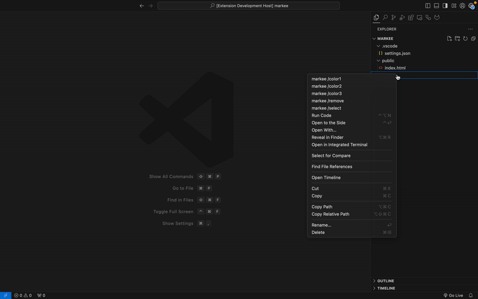
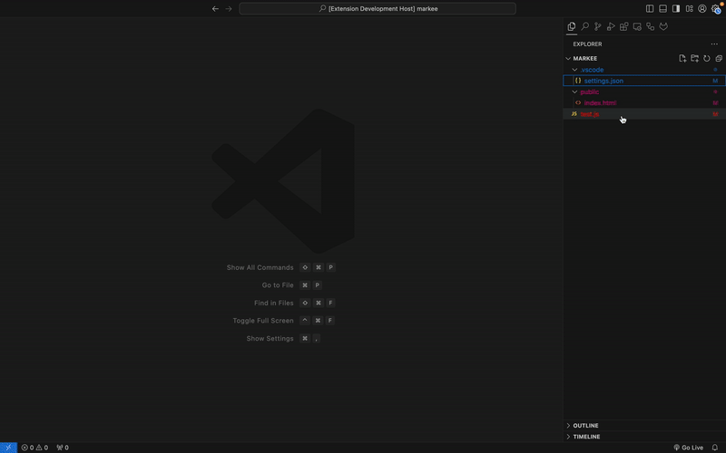
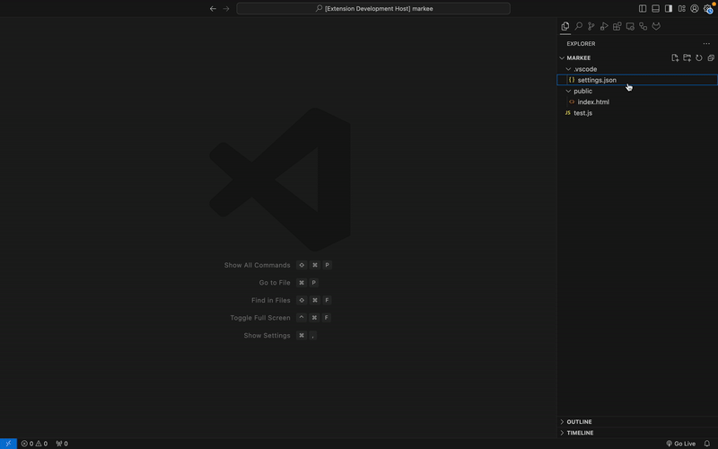
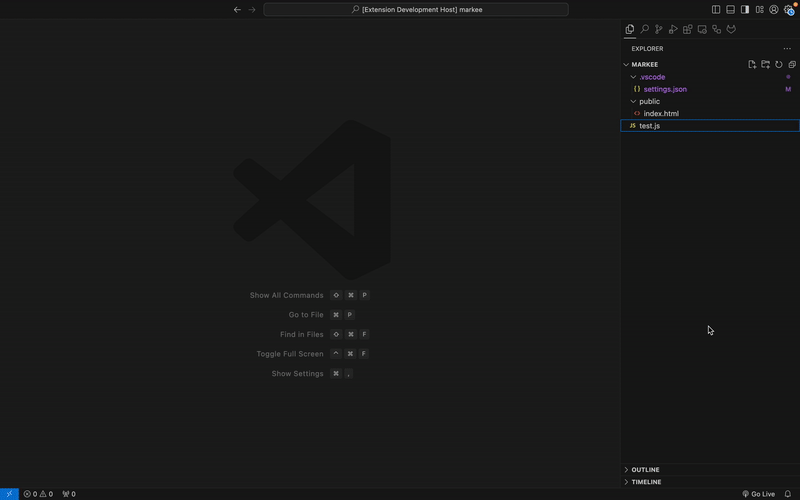
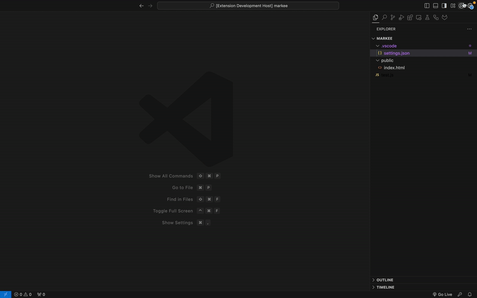

# Markee README

**Markee** is a Visual Studio Code extension that allows you to visually mark and highlight files with custom colors. Files can be marked with different colors, and the marked files are highlighted with badges and tooltips in the Explorer view. (It's all about easy identification, workspace organization and effectiency)

## Features

- Mark files with different custom colors (up to 50 customizable colors).
- Persist file marks across VS Code sessions.
- Display a badge (`■`) and a tooltip indicating the file is marked.
- Quick access to your 3 primary colors in file explorer.
  
All Show Cases:

- Show Case 1 - Select prime colors

- Show Case 2 - Remove markees

- Show Case 3 - Select from 50 different colors

- Show Case 4 - Assign custom color to any markee

- Show Case 5 - Assign custom color to marke via file

## Commands

Markee provides the following commands to mark/unmark files:

- **Mark File with Color**: Select a file and mark it with a chosen color.
- **Remove File**: Remove a previously marked file, returning it to the default view.
- **Apply Predefined Colors**: Choose from predefined colors to apply to selected files. You can access these commands via the Command Palette (`Ctrl+Shift+P` on Windows/Linux or `Cmd+Shift+P` on macOS) and search for the following:

- `>markee /edit`
- `>markee /remove`
- `>markee /select`
- `>markee /color1`
- `>markee /color2`
- `>markee /color3`

## Requirements

No dependencies.

## For more information
My email is lestev.mi@gmail.com

## To Support
There's no greater support than to read this [book](https://m.egwwritings.org/en/book/130.4), thank you.