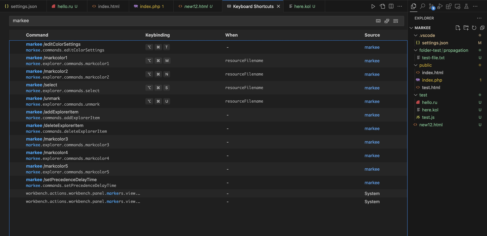

# Markee VS Code Extension

**Markee** is a Visual Studio Code extension that enables you to mark and prioritize files with custom colors, badges, and tooltips in the Explorer view. 

> Extension was made for quick identification, workspace organization and projects efficiency.

## Features

- Mark files with up to 50 customizable colors.
- Quick access to 5 primary colors from the Explorer.
- Customizable color palette for file marking.
- Persist file marks across sessions (global storage).
- Set priotiry to override git extension color styles 🤨?
- Customize badge symbols (up to 2 letters).
- Display tooltips for marked files.

> [!WARNING]  
> After installing the extension, you may see grey colors. Simply reload Visual Studio Code, and it should resolve the issue. For more details, please refer to [here](#contributions-and-complexities).

### Commands

Feature 1. Mark or unmark files
> Commands used in the video:
- `>markee /markcolor1`
- `>markee /markcolor2`
- `>markee /markcolor3`
- `>markee /markcolor4`
- `>markee /markcolor5`
- `>markee /unmark`

> [!IMPORTANT]  
> If you have initialized a Git repository, you may encounter an issue where Markee colors override Git styles. To resolve this, reload VS Code to reset the decoration provider cycle. In some cases, you might need to reload multiple times. For more details, please refer to [here](#contributions-and-complexities).

Feature 2. Add or remove exlorer items
> Commands used in the video:
- `>markee /deleteExplorerItem`
- `>markee /addExplorerItem`

Feature 3. Select colornames (dropdown)
> Commands used in the video:
- `>markee /select`

Feature 4. Change colornames settings
> Commands used in the video:
- `>markee /editColorSettings`

Feature 5. Change default precedence delay time
> Commands used in the video:
- `>markee /setPrecedenceDelayTime`

### Default Shortcuts 

### Overall Commands:

- **Explorer Context Menu**:
  - `>markee /markcolor1`
  - `>markee /markcolor2`
  - `>markee /markcolor3`
  - `>markee /markcolor4`
  - `>markee /markcolor5`
  - `>markee /unmark`
  - `>markee /select`
  
- **Command Palette** (`Ctrl+Shift+P` on Windows/Linux or `Cmd+Shift+P` on macOS):
  - `>markee /editColorSettings`
  - `>markee /deleteExplorerItem`
  - `>markee /addExplorerItem`
  - `>markee /setPrecedenceDelayTime`

## Contributions and Complexities
There are certain aspects I would love to work on, but they turned out to be very complex in nature. Here are the specific areas of the project I have struggled with:

1. <s>**Visibility of Markees**</s> (Implemented)  
   When a Git repository is initialized, markees are not visible; although the badges appear, the colors do not display properly due to Git's default color settings (modified, added, etc.). The only workaround currently is to reload Visual Studio Code, which is not ideal.

2. **Default Colors for Warnings and Errors**  
   I did not find the way around with the default colors for warnings, errors, etc. These colors take precedence and are displayed regardless of user settings.

3. <s>**Custom Settings for Markees**</s> (Mostly implemented)  
   If the above issues can be resolved, I propose adding four custom settings for each markee when the command `>markee /editColors` is used:
   - **Priority Parameter**: Add a `priority` field (ranging from 0 to 5).
   - **Propagate Parameter**: Introduce a `propagate` field (true/false) to control color propagation to parent folders.
   - **Custom Badge Selection**: Allow users to choose a custom badge.
   - **Default Color Hex Input**: Retain the default color hex input as it is.

4. **Grey Colors When Installed**  
   When the extension is installed, you may notice grey colors instead of the usual ones. This is likely due to the extension's load time, though the exact cause of the issue has not yet been determined.

If we can do it, that will be a great good for others!
> [!NOTE]  
> "Therefore, whatever you want men to do to you, do also to them, for this is the Law and the Prophets."

## Requirements

No external dependencies.

## For more information
My email is lestev.mi@gmail.com

## To Support
There's no greater support than to read this [book](https://m.egwwritings.org/en/book/130.4), thank you.