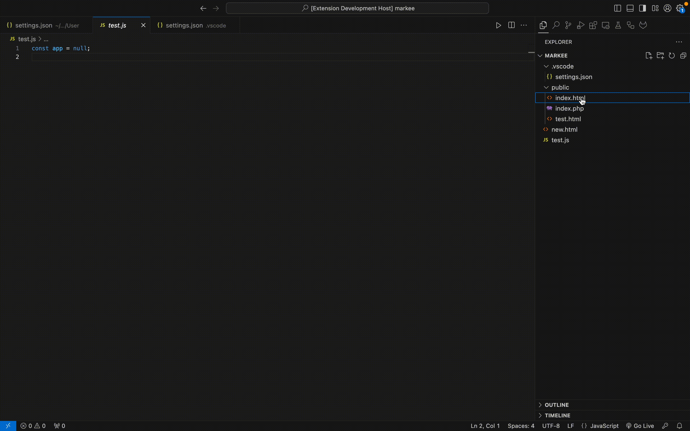
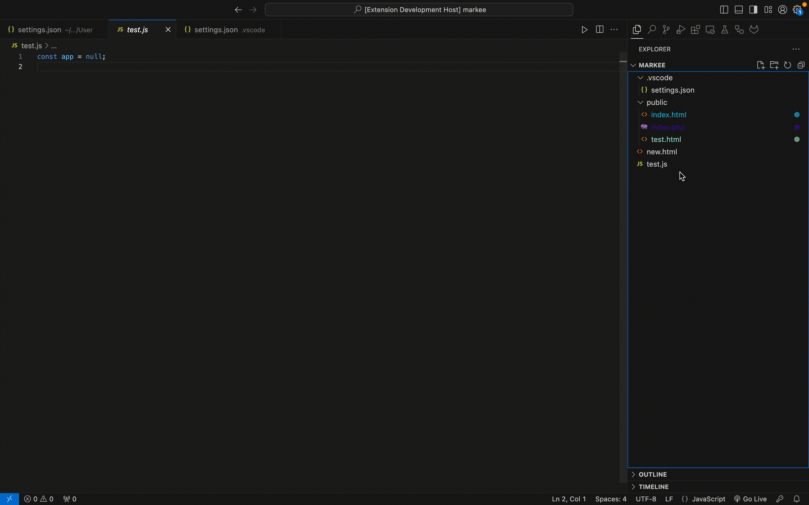

# Markee VS Code Extension

**Markee** is a Visual Studio Code extension that allows you to visually mark and highlight files with custom colors. Files can be marked with different colors, and the marked files are highlighted with badges and tooltips in the Explorer view. 

> Extension was made for quick identification, workspace organization and projects efficiency.

## Features

- Mark files with up to 50 customizable colors.
- Quick access to 5 primary colors from the Explorer.
- Customizable color palette for file marking.
- Persist file marks across sessions using global storage.
- Display badges and tooltips for marked files.
- Customizable badge symbols.
  
### Commands

Feature 1. Mark or unmark files
> Commands used in the video:
- `>markee /markcolor1`
- `>markee /markcolor2`
- `>markee /markcolor3`
- `>markee /markcolor4`
- `>markee /markcolor5`
- `>markee /unmark`

Feature 2. Change file's badge
> Commands used in the video:
- `>markee /changeBadge`

- Feature 3. Add or remove exlorer items
> Commands used in the video:
- `>markee /deleteExplorerItem`
- `>markee /addExplorerItem`

- Feature 4. Select dropdown colors
> Commands used in the video:
- `>markee /select`

- Feature 5. Change hex colors
> Commands used in the video:
- `>markee /editColors`

### Overall Commands:

- **Explorer Context Menu**:
  - `>markee /markcolor1`
  - `>markee /markcolor2`
  - `>markee /markcolor3`
  - `>markee /markcolor4`
  - `>markee /markcolor5`
  - `>markee /unmark`
  - `>markee /select`
  
- **Command Palette** (`Ctrl+Shift+P` on Windows/Linux or `Cmd+Shift+P` on macOS):
  - `>markee /editColors`
  - `>markee /deleteExplorerItem`
  - `>markee /addExplorerItem`
  - `>markee /changeBadge`

## Requirements

No external dependencies.

## For more information
My email is lestev.mi@gmail.com

## To Support
There's no greater support than to read this [book](https://m.egwwritings.org/en/book/130.4), thank you.